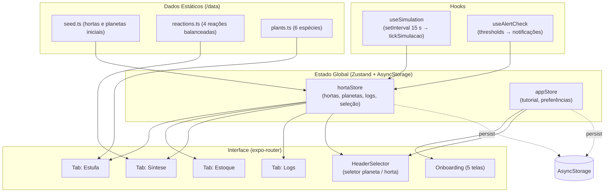

# TerraForm — Planejamento Técnico de Implementação

**Versão:** 1.1 | **Data:** 2026-05-29 (atualizado para refletir estrutura do usuário)

---

## 0. Premissas das Decisões de Produto

| Decisão | Escolha |
|---|---|
| Simulação de consumo | `setInterval` em foreground (15 s/tick) |
| Unidade dos galões e compostos | Porcentagem (0–100%) |
| Criação de hortas | Apenas seed pré-definido (sem criação pelo usuário) |
| Plantas por horta | Uma espécie por horta |

---

## 1. Arquitetura Geral

O app segue arquitetura **unidirecional** clássica React Native:

1. **Dados estáticos** (`/data`) — definições imutáveis de planetas, reações e seed
2. **Stores Zustand** (`/store`) — estado global mutável, persistido via AsyncStorage
3. **Hooks** (`/hooks`) — lógica de simulação e efeitos colaterais isolados
4. **UI** (`/app`, `/components`) — lê estado dos stores, dispara actions

### Diagrama de Dependências



### Fluxo de Dados — Exemplo (sintetizar composto)

```
Usuário toca "Sintetizar" (Síntese)
  → hortaStore.sintetizarComposto(hortaId, 'NH3', unidades)
    → Valida estoque de reagentes
    → Debita estoqueAtomos (N e H)
    → Credita estoqueCompostos.NH3
    → Adiciona LogEntry (tipo: 'sintese')
    → Zustand persist → AsyncStorage (automático via middleware)
  → Componentes reagem ao novo estado via Zustand subscriptions
```

---

## 2. Justificativa de Stack

### Zustand vs Context API
Zustand elimina re-renders desnecessários: Context recalcula toda a árvore a cada mudança de estado. Com 8 hortas, cada uma com 20+ campos atualizados a cada 15 s pelo timer, Context causaria degradação de performance visível. Zustand usa seletores por componente.

Suporte de primeira classe ao middleware `persist` com AsyncStorage — 3 linhas para persistência completa.

### expo-router vs React Navigation
expo-router é a solução oficial do Expo 56 (file-based routing). Mais limpo que React Navigation manual, sem registrar rotas programaticamente. A migração do `App.js` atual para expo-router é simples.

### AsyncStorage vs SQLite/MMKV
Os dados são simples (sem queries relacionais). AsyncStorage com JSON serialization é suficiente, integra diretamente com `zustand/middleware/persist`, e **não exige `expo prebuild`**. SQLite e MMKV exigem build nativo.

### Bibliotecas opcionais — decisões

| Biblioteca | Decisão | Motivo |
|---|---|---|
| `react-native-svg` | Incluir | Essencial para GaugeCircular e PlantVisualization |
| `expo-linear-gradient` | Incluir | Background galáctico com gradientes |
| `expo-notifications` | Incluir com fallback | Alertas push; fallback in-app se indisponível |
| `expo-haptics` | Incluir | Feedback tátil em ações; sem build nativo |
| `react-native-reanimated` | Avaliar | Provavelmente já incluso no Expo 56 |
| `victory-native` / `react-native-chart-kit` | Descartar | Pesado; gauges SVG customizados são mais adequados |
| `@gorhom/bottom-sheet` | Descartar | Exige Gesture Handler configurado; usar Modal nativo |

---

## 3. Estrutura de Pastas

```
TerraForm/
├── app/
│   ├── _layout.tsx               # Root layout: Stack, providers, setup do timer
│   ├── index.tsx                 # Redirect: (auth) se tutorial pendente, (tabs) caso contrário
│   ├── auth.tsx                  # Rota alternativa de verificação de estado de auth/onboarding
│   ├── (auth)/
│   │   └── index.tsx             # Tutorial de primeira abertura (5 telas, estado interno)
│   ├── (tabs)/
│   │   ├── _layout.tsx           # Tab bar (4 abas) + Header global
│   │   ├── estufa.tsx            # Tab 1: Dashboard da estufa
│   │   ├── estoque.tsx           # Tab 2: Galões e compostos
│   │   ├── sintese.tsx           # Tab 3: Reações químicas
│   │   └── logs.tsx              # Tab 4: Histórico de eventos
│   ├── (app)/                    # Telas não-tab acessíveis via Stack (detail screens, modais)
│   │   └── (vazio por ora)
│   └── context/                  # React Context providers que complementam Zustand
│       └── (ex: NotificationContext, ToastContext)
├── components/
│   ├── ui/                       # Primitivos visuais genéricos
│   │   ├── GaugeCircular.tsx     # Gauge SVG circular para nutrientes
│   │   ├── ProgressBar.tsx       # Barra de progresso horizontal
│   │   ├── StatusBadge.tsx       # Badge ótimo / atenção / crítico
│   │   ├── NivelIndicator.tsx    # Indicador vertical de nível de galão
│   │   └── GradientBackground.tsx
│   ├── horta/
│   │   ├── PlantVisualization.tsx
│   │   ├── NutrienteCard.tsx     # Card com GaugeCircular + nome + valor
│   │   ├── SoloQualidadeCard.tsx
│   │   ├── ArQualidadeCard.tsx
│   │   └── GravityIndicator.tsx  # Badge "Gravidade: 0.38 g"
│   ├── estoque/
│   │   ├── GallonCard.tsx        # Card de galão com botão Repor
│   │   └── CompostoCard.tsx      # Card de composto com botão Aplicar
│   ├── sintese/
│   │   └── ReacaoCard.tsx        # Card de reação com stepper e validação
│   ├── logs/
│   │   └── LogEntryItem.tsx      # Item da lista de log
│   └── layout/
│       ├── HeaderSelector.tsx    # Dropdowns planeta / horta
│       └── AplicarCompostoSheet.tsx # Modal de aplicação de composto
│
├── store/
│   ├── hortaStore.ts             # Store principal
│   └── appStore.ts               # Store auxiliar (tutorial, etc.)
│
├── data/
│   ├── seed.ts                   # 5 planetas + 8 hortas com dados iniciais
│   ├── reactions.ts              # 4 reações com custos e efeitos
│   └── plants.ts                 # Metadados das 6 espécies
│
├── types/
│   └── index.ts                  # Todos os tipos TypeScript
│
├── constants/
│   ├── colors.ts                 # Paleta completa + cores por nutriente
│   ├── thresholds.ts             # Limites de atenção e crítico
│   └── simulation.ts             # TICK_INTERVAL_MS e taxas de consumo
│
├── hooks/
│   ├── useSimulation.ts          # setInterval → tickSimulacao
│   └── useAlertCheck.ts          # Verifica thresholds após cada tick
│
└── utils/
    ├── chemistry.ts              # Custo de síntese, efeitos de aplicação
    ├── agriculture.ts            # soloQualidade, arQualidade, crescimento
    ├── gravity.ts                # gravityFactor(g: number): number
    └── formatters.ts             # Timestamps, números, unidades
```

---

## 4. Modelagem de Dados Final

### 4.1 Tipos TypeScript (types/index.ts)

```typescript
export type AtomKey = 'N' | 'P' | 'K' | 'Ca' | 'Mg' | 'S' | 'O' | 'H' | 'C';
export type CompoundKey = 'H2O' | 'NH3' | 'CaCO3' | 'H2CO3';
export type SoloNutrienteKey = 'N' | 'P' | 'K' | 'Ca' | 'Mg' | 'S';
export type FaseCrescimento = 'germinacao' | 'mudas' | 'vegetativo' | 'floracao' | 'colheita';
export type EspeciePlanta = 'alface' | 'batata' | 'tomate' | 'trigo' | 'cenoura' | 'soja';
export type TipoLog = 'aplicacao' | 'sintese' | 'reposicao' | 'alerta' | 'crescimento' | 'leitura';
export type NivelAlerta = 'atencao' | 'critico';

// Todos os valores de estoque em 0–100%
export type AtomStocks = Record<AtomKey, number>;
export type CompoundStocks = Record<CompoundKey, number>;
export type SoloNutrientes = Record<SoloNutrienteKey, number>;

export type Planeta = {
  id: string;
  nome: string;
  gravidade: number;  // g relativo à Terra (1.0 = Terra)
  cor: string;        // hex
};

export type Planta = {
  especie: EspeciePlanta;
  fase: FaseCrescimento;
  progressoFase: number;  // 0–100 dentro da fase atual
};

export type Solo = {
  ph: number;                 // 0.0–14.0 (ideal 6.0–7.0)
  qualidade: number;          // 0–100 (campo derivado — recalculado após cada mudança)
  nutrientes: SoloNutrientes; // cada campo: 0–100%
  umidade: number;            // 0–100%
};

export type Ar = {
  qualidade: number;  // 0–100 (campo derivado)
  o2: number;         // % real (ideal 19–22, ex: 21.0)
  co2: number;        // % real (ideal 0.03–0.08, ex: 0.04)
  umidade: number;    // 0–100%
};

export type Horta = {
  id: string;
  nome: string;
  planetaId: string;
  planta: Planta;
  solo: Solo;
  ar: Ar;
  estoqueAtomos: AtomStocks;
  estoqueCompostos: CompoundStocks;
};

export type LogEntry = {
  id: string;
  timestamp: string;    // ISO 8601
  planetaId: string;
  hortaId: string;
  tipo: TipoLog;
  descricao: string;
  nivel?: NivelAlerta;  // presente apenas em tipo === 'alerta'
};
```

### 4.2 Tabela de Escalas e Thresholds

| Campo | Escala | Ideal | Atenção | Crítico |
|---|---|---|---|---|
| `estoqueAtomos.*` | 0–100% | 40–100% | < 25% | < 10% |
| `estoqueCompostos.*` | 0–100% | 20–100% | < 20% | < 10% |
| `solo.nutrientes.*` | 0–100% | 40–80% | < 25% | < 15% |
| `solo.umidade` | 0–100% | 35–65% | < 25% ou > 80% | < 15% |
| `solo.ph` | 0.0–14.0 | 6.0–7.0 | < 5.5 ou > 7.5 | < 5.0 ou > 8.0 |
| `ar.o2` | % real | 19–22% | < 18% ou > 26% | < 16% |
| `ar.co2` | % real | 0.03–0.08% | > 0.5% | > 1.5% |
| `ar.umidade` | 0–100% | 50–70% | < 30% ou > 85% | < 20% |

> **O₂ e CO₂** usam % reais (ex: 21.0%, 0.04%) para exibição honesta na UI. Os demais usam índice 0–100%.

---

## 5. Lógica de Consumo de Nutrientes

### 5.1 Fator de Gravidade

```
gravityFactor(g) = 0.7 + g × 0.3
```

| Planeta | g | Fator | Consumo vs Terra |
|---|---|---|---|
| Europa | 0.13 | 0.739 | 73.9% |
| Titã | 0.14 | 0.742 | 74.2% |
| Lua | 0.17 | 0.751 | 75.1% |
| Marte | 0.38 | 0.814 | 81.4% |
| Terra | 1.00 | 1.000 | 100% |

Planetas com gravidade menor consomem recursos mais lentamente (distribuição de fluidos menos eficiente), mas também crescem mais devagar.

### 5.2 Taxas de Consumo Base (por tick, Terra, condições ideais)

| Campo | Δ/tick | Observação |
|---|---|---|
| `solo.N` | −0.8% | Macronutriente primário |
| `solo.P` | −0.5% | Macronutriente secundário |
| `solo.K` | −0.6% | Macronutriente primário |
| `solo.Ca` | −0.3% | Consumo moderado |
| `solo.Mg` | −0.2% | Consumo lento |
| `solo.S` | −0.2% | Consumo lento |
| `solo.umidade` | −1.0% | Transpiração + drenagem |
| `ar.o2` | −0.1% | Respiração das plantas |
| `ar.co2` | +0.02% | Respiração das plantas |
| `ar.umidade` | −0.3% | Transpiração |

Consumo efetivo = taxa base × gravityFactor. Campos não podem cair abaixo de 0 (clampar).

### 5.3 TICK_INTERVAL_MS

```typescript
// constants/simulation.ts
export const TICK_INTERVAL_MS = 15_000; // 15 segundos
export const TICK_MULTIPLIER = 1.0;     // ajustar para demo rápido se necessário
```

O timer é iniciado via `useSimulation` hook no `app/_layout.tsx`. O cleanup do `clearInterval` evita vazamento quando o componente é desmontado.

### 5.4 Crescimento das Plantas

GP (growth points) ganhos por tick:
```
gp = BASE_GP × (soloQualidade / 100) × (arQualidade / 100) × gravityFactor
BASE_GP = 2.0
```

Duração de cada fase em GP:

| Fase | GP necessários | Ticks aprox. (condições ideais, Terra) |
|---|---|---|
| Germinação | 100 | 50 ticks (~12 min) |
| Mudas | 200 | 100 ticks (~25 min) |
| Vegetativo | 300 | 150 ticks (~37 min) |
| Floração | 250 | 125 ticks (~31 min) |
| Colheita | — (final) | — |

### 5.5 Cálculo dos Índices de Qualidade Derivados

**soloQualidade (0–100):**

```
nutriScore = média de score(v) para cada nutriente N,P,K,Ca,Mg,S
  score(v):
    v ∈ [40, 80]     → 1.0
    v ∈ [20, 40)     → (v − 20) / 20    (ramp up)
    v ∈ (80, 100]    → 1 − (v − 80) / 40 (pequena penalidade por excesso)
    v < 20           → v / 20 (ramp down severo)

phScore:
    pH ∈ [6.0, 7.0]  → 1.0
    linear drop até 0 em pH < 4.5 ou > 8.5

umidadeScore:
    umidade ∈ [35, 65] → 1.0
    linear drop até 0 em < 10 ou > 90

soloQualidade = (nutriScore × 0.6 + phScore × 0.2 + umidadeScore × 0.2) × 100
```

**arQualidade (0–100):**

```
o2Score:   o2 ∈ [19, 22]  → 1.0 ; drop até 0 fora de [15, 30]
co2Score:  co2 < 0.08     → 1.0 ; linear drop até 0 em co2 > 2.0
humScore:  umidade ∈ [50, 70] → 1.0 ; drop fora do range

arQualidade = (o2Score × 0.4 + co2Score × 0.4 + humScore × 0.2) × 100
```

Ambos os índices são recalculados sempre que o estado da horta muda (síntese, aplicação, tick).

---

## 6. Sistema de Síntese

### 6.1 Custo por Unidade de Síntese

Uma "unidade" produz **10% do composto**. O usuário escolhe quantas unidades sintetizar via stepper (min: 1, max: limitado pelo reagente mais escasso).

| Composto | Equação Exibida | Custo por unidade (→10% produzido) |
|---|---|---|
| **H₂O** | 2H₂ + O₂ → 2H₂O | H: −8%, O: −4% |
| **NH₃** | N₂ + 3H₂ → 2NH₃ | N: −4%, H: −12% |
| **CaCO₃** | Ca + CO₂ + ½O₂ → CaCO₃ | Ca: −5%, C: −5%, O: −8% |
| **H₂CO₃** | CO₂ + H₂O → H₂CO₃ | C: −4%, O: −6%, **H₂O: −6%** *(composto!)* |

> H₂CO₃ exige H₂O do estoque de compostos. O usuário precisa sintetizar H₂O antes.  
> Esta dependência é exibida claramente na UI do card de H₂CO₃.

### 6.2 Tipo de Reação (data/reactions.ts)

```typescript
type Reagente = {
  tipo: 'atomo' | 'composto';
  chave: AtomKey | CompoundKey;
  custoPor10: number;
};

type Reacao = {
  composto: CompoundKey;
  nomeExibicao: string;
  equacao: string;          // usar unicode subscript: "2H₂ + O₂ → 2H₂O"
  funcao: string;
  reagentes: Reagente[];
  alvoAplicacao: 'solo' | 'ar' | 'ambos';
};
```

> Subscripts em fórmulas: usar caracteres unicode diretamente (₂, ₃, etc.) — React Native não suporta `<sub>` HTML.

### 6.3 Validação na UI

- Botão "Sintetizar" desabilitado se: `quantidade pedida × custo > estoque disponível` para qualquer reagente
- Exibir custo total dinamicamente ("Custo: 32% H, 16% O") conforme o stepper muda
- Exibir resultado esperado ("Produz: 40% NH₃")

---

## 7. Efeitos de Aplicação de Compostos

Efeitos por **10% de composto aplicado** (escalam linearmente com a quantidade):

| Composto | Alvo | Efeitos |
|---|---|---|
| **H₂O** | Solo | `solo.umidade +12%`, pH normaliza levemente para 7.0 |
| **H₂O** | Ar | `ar.umidade +8%` |
| **NH₃** | Solo | `solo.nutrientes.N +15%`, `solo.ph +0.2` |
| **CaCO₃** | Solo | `solo.nutrientes.Ca +12%`, `solo.ph +0.3` |
| **H₂CO₃** | Solo | `solo.ph −0.4`, `solo.umidade +4%` |

**Alvos disponíveis:**
- H₂O → Solo **ou** Ar
- NH₃ → Solo apenas (amônia no ar seria tóxico — botão "Ar" bloqueado na UI com explicação)
- CaCO₃ → Solo apenas (sólido)
- H₂CO₃ → Solo apenas (acidificante)

Todos os valores são clampados nos limites naturais após aplicação (pH: 0–14, umidade: 0–100, etc.).

---

## 8. Seed de Dados

### 8.1 Planetas

```typescript
export const PLANETAS: Planeta[] = [
  { id: 'lua',    nome: 'Lua',    gravidade: 0.17, cor: '#A0A0A8' },
  { id: 'marte',  nome: 'Marte',  gravidade: 0.38, cor: '#C1440E' },
  { id: 'europa', nome: 'Europa', gravidade: 0.13, cor: '#4488CC' },
  { id: 'tita',   nome: 'Titã',   gravidade: 0.14, cor: '#D4A017' },
  { id: 'terra',  nome: 'Terra',  gravidade: 1.00, cor: '#2E8B57' },
];
```

### 8.2 Espécies de Plantas

| Espécie | Nome Científico | Cor temática |
|---|---|---|
| alface | *Lactuca sativa* | `#39FF14` (verde neon) |
| batata | *Solanum tuberosum* | `#D4A017` (dourado) |
| tomate | *Solanum lycopersicum* | `#FF6B35` (laranja) |
| trigo | *Triticum aestivum* | `#FFD700` (amarelo) |
| cenoura | *Daucus carota* | `#FF8C00` (laranja escuro) |
| soja | *Glycine max* | `#90EE90` (verde claro) |

### 8.3 Hortas do Seed (8 hortas, condições variadas para demo rico)

| ID | Nome | Planeta | Espécie | Fase | Estado inicial |
|---|---|---|---|---|---|
| `lua-01` | Estufa Selene-01 | Lua | Alface | vegetativo | Saudável |
| `lua-02` | Estufa Selene-02 | Lua | Batata | mudas | N em atenção (22%) |
| `marte-01` | Estufa Ares-01 | Marte | Tomate | floracao | Ótimo |
| `marte-02` | Estufa Ares-02 | Marte | Trigo | germinacao | pH elevado (7.9) |
| `europa-01` | Estufa Callisto-01 | Europa | Soja | vegetativo | P crítico (11%) |
| `tita-01` | Estufa Titã-01 | Titã | Cenoura | mudas | Saudável |
| `terra-01` | Estufa Terra-01 | Terra | Alface | colheita | Pronto para colheita |
| `terra-02` | Estufa Terra-02 | Terra | Tomate | vegetativo | Umidade baixa (18%) |

A variedade de estados garante alertas visíveis ao avaliador logo na primeira abertura.

### 8.4 Valores Típicos — Estado "Saudável"

```typescript
const TEMPLATE_SAUDAVEL = {
  solo: {
    ph: 6.5, qualidade: 85,
    nutrientes: { N: 75, P: 65, K: 70, Ca: 60, Mg: 55, S: 58 },
    umidade: 55,
  },
  ar: { qualidade: 90, o2: 21.0, co2: 0.04, umidade: 62 },
  estoqueAtomos: { N: 80, P: 75, K: 70, Ca: 65, Mg: 60, S: 62, O: 78, H: 72, C: 68 },
  estoqueCompostos: { H2O: 60, NH3: 40, CaCO3: 35, H2CO3: 25 },
};
```

---

## 9. Fluxo de Navegação

### 9.1 Primeira Abertura

```
App inicia (_layout.tsx → root Stack)
  ↓
app/index.tsx lê appStore.tutorialCompleted
  false → <Redirect href="/(auth)" />
  true  → <Redirect href="/(tabs)/estufa" />
```

### 9.2 Seletor Planeta / Horta (Header Global)

- Presente em todas as 4 abas via `app/(tabs)/_layout.tsx`
- **Dropdown Planeta**: lista 5 planetas com cor do planeta como indicador
- **Dropdown Horta**: filtrado pelo planeta selecionado; ao mudar planeta, auto-seleciona a primeira horta do novo planeta
- Estado em `hortaStore.selectedPlanetaId` e `hortaStore.selectedHortaId`
- Implementação: `Modal` + `FlatList` customizado para consistência visual (não usar `Picker` nativo)

### 9.3 Tab Bar

```
[ 🌱 Estufa ]  [ 📦 Estoque ]  [ ⚗️ Síntese ]  [ 📋 Logs ]
```

Cor ativa: `#00D4FF`. Cor inativa: `#8BA0C0`. Background da tab bar: `#0F2044`.

---

## 10. Detalhamento das Telas

### 10.1 Estufa (/(tabs)/estufa.tsx)

**Dados:** `hortaStore.getHortaAtual()` + planeta atual  
**Layout:** `ScrollView` vertical sobre `GradientBackground`

Seções de cima para baixo:

1. **GravityIndicator** — badge "Gravidade: 0.38 g"
2. **PlantVisualization** — representação SVG da planta na fase atual (por espécie + fase)
3. **Progresso de Crescimento** — `ProgressBar` + label da fase (nome em pt-BR) + espécie
4. **SoloQualidadeCard** — índice 0–100 com `StatusBadge` + pH atual
5. **ArQualidadeCard** — índice 0–100 + O₂%, CO₂%, umidade%
6. **Nutrientes** — grid 2×3 de `NutrienteCard` com `GaugeCircular` (N, P, K, Ca, Mg, S)
7. **Reservatórios** — linha de `NivelIndicator` mini para os 9 átomos

**Ações:** Nenhuma (tela de leitura).

---

### 10.2 Estoque (/(tabs)/estoque.tsx)

**Dados:** `estoqueAtomos` e `estoqueCompostos` da horta atual  
**Layout:** `ScrollView` com duas seções separadas

**Seção 1 — Elementos Brutos (9 cards):**  
Cada `GallonCard`: símbolo em cor temática, nome, `ProgressBar` de nível, % textual, botão "Repor" → `Alert.alert` de confirmação → `hortaStore.reporGalao(hortaId, atomKey)`.

**Seção 2 — Compostos Sintetizados (4 cards):**  
Cada `CompostoCard`: nome + fórmula, nível atual, função resumida, botão "Aplicar" → abre `AplicarCompostoSheet`.

**AplicarCompostoSheet (Modal):**
- Seleção de alvo: "Solo" / "Ar" (quando aplicável; CaCO₃ e H₂CO₃ exibem apenas "Solo")
- Slider de quantidade: 10%–50%, step 10%
- Preview dos efeitos esperados
- Botão "Confirmar" → `hortaStore.aplicarComposto(...)`

---

### 10.3 Síntese (/(tabs)/sintese.tsx)

**Dados:** `estoqueAtomos` + `estoqueCompostos` da horta atual + `REACTIONS` (estático)  
**Layout:** `ScrollView` com 4 `ReacaoCard`

Cada `ReacaoCard`:
- Nome + fórmula do composto
- Equação balanceada (unicode subscripts)
- Função/uso
- Status dos reagentes (nível atual de cada um)
- Stepper de unidades (1–N, onde N = max suportado pelos reagentes)
- Custo total e produção esperada atualizados dinamicamente
- Botão "Sintetizar" (desabilitado em vermelho se reagentes insuficientes)

---

### 10.4 Logs (/(tabs)/logs.tsx)

**Dados:** `hortaStore.logs` filtrados  
**Layout:** Header fixo com `SegmentedControl` + `FlatList`

**Filtros:**
- **Horta**: `hortaId === selectedHortaId`
- **Planeta**: `planetaId === selectedPlanetaId`
- **Global**: todos os logs

**Cada LogEntryItem:**
- Ícone por tipo (💧 aplicação, 🧪 síntese, 📥 reposição, ⚠️ alerta, 🌱 crescimento, 📊 leitura)
- Timestamp relativo ("há 3 min") ou absoluto ("14:32:01")
- Planeta + Horta (nos modos Planeta e Global)
- Descrição
- Badge de nível (`NivelAlerta`) nos alertas

**Performance:** `FlatList` com `keyExtractor` e `getItemLayout`. Máximo de **500 entries** (FIFO — remover os mais antigos no `addLog`).

---

## 11. Stores Zustand

### hortaStore (store/hortaStore.ts)

```typescript
interface HortaState {
  planetas: Planeta[];
  hortas: Horta[];
  selectedPlanetaId: string;
  selectedHortaId: string;
  logs: LogEntry[];

  // Seletores derivados
  getHortaAtual: () => Horta | undefined;
  getPlanetaAtual: () => Planeta | undefined;
  getHortasByPlaneta: (planetaId: string) => Horta[];

  // Actions
  selectPlaneta: (id: string) => void;
  selectHorta: (id: string) => void;
  tickSimulacao: () => void;
  aplicarComposto: (hortaId: string, composto: CompoundKey, alvo: 'solo' | 'ar', quantidade: number) => void;
  sintetizarComposto: (hortaId: string, composto: CompoundKey, unidades: number) => void;
  reporGalao: (hortaId: string, atomo: AtomKey) => void;
  addLog: (entry: Omit<LogEntry, 'id' | 'timestamp'>) => void;
}
```

Persistido via `persist` middleware: chave `'terraform-horta-store'`.

> **Hydration inicial:** O `persist` middleware carrega o AsyncStorage assincronamente. Usar `useHortaStore.persist.hasHydrated()` para exibir loading screen enquanto os dados não chegaram.

### appStore (store/appStore.ts)

```typescript
interface AppState {
  tutorialCompleted: boolean;
  completeTutorial: () => void;
}
```

Persistido: chave `'terraform-app-store'`.

---

## 12. Componentes Reutilizáveis

| Componente | Props principais | Responsabilidade |
|---|---|---|
| `GaugeCircular` | `value`, `maxValue`, `color`, `size` | SVG gauge circular (react-native-svg) |
| `ProgressBar` | `value`, `maxValue`, `color`, `height` | Barra horizontal genérica |
| `StatusBadge` | `value: number` (0–100) | Exibe Ótimo / Atenção / Crítico |
| `NivelIndicator` | `symbol`, `value`, `color` | Indicador vertical mini de galão |
| `GradientBackground` | `children` | Background galáctico padrão |
| `PlantVisualization` | `especie`, `fase`, `progresso` | SVG ou imagem da planta |
| `NutrienteCard` | `nutriente: SoloNutrienteKey`, `value`, `color` | Card com GaugeCircular |
| `SoloQualidadeCard` | `solo: Solo` | Card completo do solo |
| `ArQualidadeCard` | `ar: Ar` | Card completo do ar |
| `GravityIndicator` | `gravidade: number` | Badge de gravidade |
| `GallonCard` | `atomKey`, `value`, `onRepor` | Card de galão com botão Repor |
| `CompostoCard` | `compoundKey`, `value`, `onAplicar` | Card de composto com botão Aplicar |
| `ReacaoCard` | `reaction`, `stocks`, `onSintetizar` | Card completo de síntese |
| `LogEntryItem` | `entry`, `showPlanetaHorta` | Item de log |
| `HeaderSelector` | — | Dropdowns globais planeta/horta |
| `AplicarCompostoSheet` | `compound`, `onConfirm`, `visible` | Modal de aplicação |

---

## 13. Sistema de Notificações

`expo-notifications` funciona no Expo Go em **dispositivos físicos Android** mas não no simulador iOS. Estratégia com fallback:

1. Solicitar permissões após conclusão do tutorial
2. Se negado/indisponível: usar in-app banner animado (Toast) como fallback
3. `useAlertCheck` roda após cada `tickSimulacao` e verifica thresholds críticos

**Deduplicação:** manter `Set<string>` de alertas já notificados (chave: `hortaId + campo`). Limpar da deduplicação quando o valor voltar ao normal.

**Formato das notificações:**
```
Título: "⚠️ TerraForm — Alerta Crítico"
Corpo:  "Fósforo crítico (11%) em Europa — Estufa Callisto-01"
```

---

## 14. Sistema de Tutorial (Onboarding)

5 telas em `app/(auth)/index.tsx` — estado interno de página com `useState`:

| Nº | Título | Conteúdo |
|---|---|---|
| 1 | Bem-vindo ao TerraForm | Logo, descrição da missão, FIAP × NASA |
| 2 | Estufas Espaciais | Conceito de estufa isolada, gravidade, planetas |
| 3 | Recursos | Átomos brutos, galões, compostos sintetizados |
| 4 | Síntese e Aplicação | Como criar e usar compostos para corrigir o ambiente |
| 5 | Missão Iniciada | Resumo + botão "Iniciar Missão" |

- Botão "Pular" disponível nas telas 1–4 (vai para tela 5)
- Tela 5: `appStore.completeTutorial()` → `router.replace('/(tabs)/estufa')`

> Rota: `/(auth)` (grupo sem segmento de URL). O `(auth)` não aparece na URL — é apenas agrupamento estrutural no expo-router.

---

## 15. Dependências NPM

```bash
# JÁ INSTALADOS (não reinstalar):
# expo-router, @react-native-async-storage/async-storage
# expo-constants, expo-linking, expo-status-bar
# react-native-safe-area-context, react-native-screens
# package.json main já é "expo-router/entry"

# AINDA A INSTALAR:
npx expo install zustand
npx expo install expo-linear-gradient react-native-svg
npx expo install expo-notifications expo-haptics
npx expo install typescript @types/react @types/react-native

# Verificar se já inclusos no Expo 56 (não reinstalar sem checar):
# react-native-reanimated, react-native-gesture-handler, expo-font
```

> Antes de instalar qualquer lib, confirmar versão compatível com Expo 56 em `https://docs.expo.dev/versions/v56.0.0/`.

### NÃO instalar
- `react-native-sqlite-storage` — exige prebuild
- `react-native-mmkv` — exige prebuild
- `@gorhom/bottom-sheet` — complexidade de setup não justificada; usar `Modal` nativo
- `victory-native` / `react-native-chart-kit` — pesado; gauges SVG customizados são suficientes

---

## 16. Roadmap de Implementação

| Fase | Tarefas principais | Estimativa |
|---|---|---|
| **1 — Setup** | ~~Migrar para expo-router~~ (feito), configurar TypeScript, instalar deps restantes (zustand, svg, gradiente, etc.), `constants/colors.ts`, tab bar esqueleto, `app/index.tsx` com redirect | 0.5 dia |
| **2 — Dados e Estado** | `types/index.ts`, `data/seed.ts`, `data/reactions.ts`, `store/hortaStore.ts`, `store/appStore.ts`, testar persistência | 0.5–1 dia |
| **3 — Tela Estufa** | `GaugeCircular`, `ProgressBar`, `StatusBadge`, `GradientBackground`, `NutrienteCard`, `SoloQualidadeCard`, `ArQualidadeCard`, `GravityIndicator`, `PlantVisualization` (placeholder), `estufa.tsx` | 1–1.5 dias |
| **4 — Tela Estoque** | `GallonCard`, `CompostoCard`, `AplicarCompostoSheet`, `estoque.tsx`, actions `aplicarComposto` e `reporGalao` | 0.5–1 dia |
| **5 — Tela Síntese** | `ReacaoCard` com stepper e validação, `utils/chemistry.ts`, `sintese.tsx`, action `sintetizarComposto` | 0.5–1 dia |
| **6 — Tela Logs** | `LogEntryItem`, `logs.tsx` com FlatList e filtros | 0.5 dia |
| **7 — Header Global** | `HeaderSelector` com dropdowns, integração no tab layout, testar troca planeta/horta | 0.5 dia |
| **8 — Simulação** | `utils/agriculture.ts`, `utils/gravity.ts`, `hooks/useSimulation.ts`, action `tickSimulacao` completa, integração no `_layout.tsx` | 0.5–1 dia |
| **9 — Notificações + Tutorial** | `useAlertCheck.ts`, `expo-notifications` com deduplicação, `onboarding/index.tsx`, lógica de primeira abertura | 0.5–1 dia |
| **10 — Polish Visual** | Background com estrelas, animações de gauge, `PlantVisualization` com SVGs reais, feedback háptico, tipografia, testes no device | 1–2 dias |

**Estimativa total:** 6–10 dias úteis. Com 2 semanas de prazo, há margem para imprevistos e polish.

---

## 17. Perguntas em Aberto

Estas questões precisam de resposta antes ou durante a implementação:

1. **Colheita** — O que acontece quando a planta atinge a fase "colheita"? Sugestão: exibir botão "Colher" na tela Estufa que reseta a planta para `germinacao` com `progressoFase = 0`. Confirmar se isso é o comportamento desejado.

2. **Injeção de O₂ no ar** — O usuário pode aplicar Oxigênio (O) diretamente do galão para o ar, já que a tabela de recursos lista O₂ com uso em "ar e síntese"? Sugestão: adicionar botão "Injetar no Ar" no `GallonCard` de O na tela Estoque.

3. **Visualização das plantas** — Como representar visualmente? Opções: (a) SVG simples por fase (genérico), (b) ilustrações por espécie × fase (~30 assets), (c) representação abstrata animada. Opção (a) é mais viável para o prazo.

4. **Limite de logs** — 500 entries (FIFO) está ok, ou prefere ilimitado (depende de memória do device)?

5. **Velocidade de demo** — Para a apresentação, o intervalo de 15 s pode ser muito lento para mostrar o consumo em tempo real. Incluir um `TICK_MULTIPLIER` oculto para acelerar durante a demonstração?

---

## 18. Riscos e Considerações Técnicas

### Altos

1. **expo-router no Expo 56** — verificar versão exata compatível nos docs antes de instalar. Expo 56 provavelmente usa expo-router v4; a API pode diferir do v3.
2. **Zustand persist + hydration** — o estado estará `undefined` no primeiro render (antes do AsyncStorage retornar). Obrigatório implementar loading screen usando `useHortaStore.persist.hasHydrated()`.
3. **Background timer iOS** — `setInterval` é suspenso quando o app vai para background no iOS (comportamento do sistema operacional). A simulação só avança com o app em foreground. Documentar esta limitação.

### Médios

4. **expo-notifications no simulador iOS** — não funciona. Testar em device físico Android. Garantir que o fallback in-app funcione antes de depender das notificações.
5. **Crescimento da lista de logs** — com tick a cada 15 s gerando eventos, os logs podem crescer rapidamente. O limite de 500 entries com FIFO deve ser implementado desde o início.
6. **React 19 + TypeScript** — usar `@types/react@19`; algumas APIs novas podem gerar warnings de tipo.

### Baixos

7. **Subscripts químicos** — usar unicode (₂, ₃, etc.) diretamente nas strings. Documentar na convenção de código.
8. **Dropdown nativo vs customizado** — usar `Modal` + `FlatList` para os seletores do header para manter consistência com o tema visual.
9. **expo-haptics** — funciona no Expo Go sem prebuild. Adicionar `Haptics.impactAsync()` em ações de síntese e aplicação.
